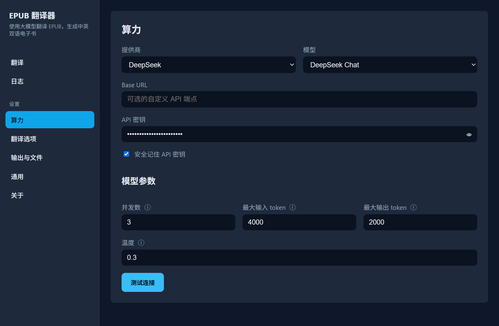
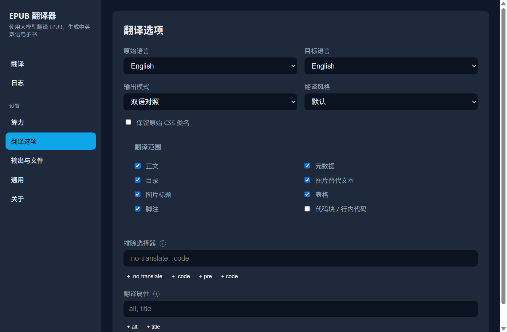
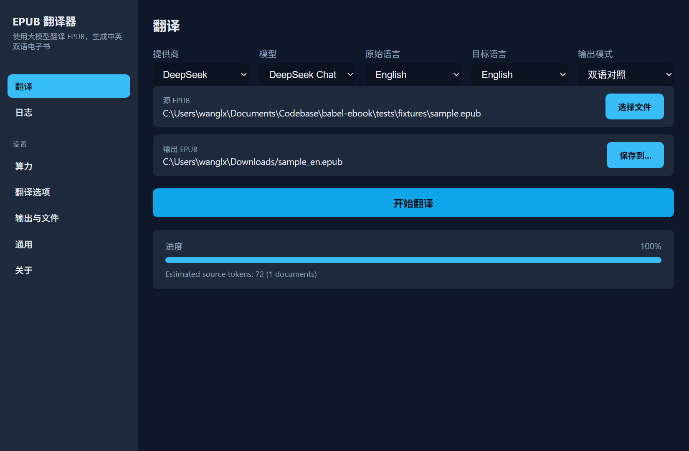
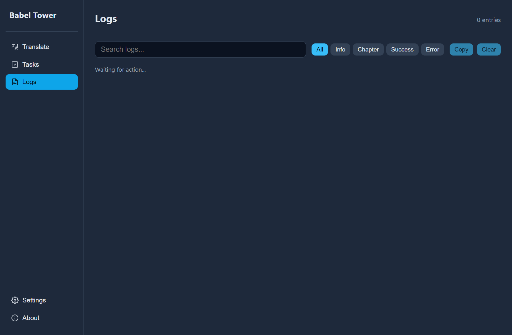

# 巴别塔 · BabelEbook

[![CI][ci-badge]][ci-url]
[![License: MIT][license-badge]][license-url]
[![Rust Version][rust-badge]][rust-url]
[![Release][release-badge]][release-url]

**BabelEbook（巴别塔）** 是一款基于大语言模型的 EPUB 翻译工具，
能把外文电子书翻译成中英双语版本：
每个翻译后的段落在前，对应的原文保留在后。

[ci-badge]: https://github.com/nevertiree/babel-ebook/actions/workflows/ci.yml/badge.svg
[ci-url]: https://github.com/nevertiree/babel-ebook/actions/workflows/ci.yml
[license-badge]: https://img.shields.io/badge/License-MIT-yellow.svg
[license-url]: ../LICENSE
[rust-badge]: https://img.shields.io/badge/rust-1.88%2B-blue.svg
[rust-url]: https://www.rust-lang.org/
[release-badge]: https://img.shields.io/github/v/release/nevertiree/babel-ebook
[release-url]: https://github.com/nevertiree/babel-ebook/releases

> 你的 EPUB 内容和 API 密钥只在你自己的电脑上处理，不会发送到开发者的服务器。
>
> 其他语言版本：
> [中文](README.md) · [English](README.en.md) · [日本語](README.ja.md) · [한국어](README.ko.md) · [Русский](README.ru.md)
> [Español](README.es.md)

<p align="center">
  
</p>

<p align="center">
  <a href="https://github.com/nevertiree/babel-ebook/releases/latest/download/BabelEbook_0.1.0_x64-setup.exe">
    
  </a>
  <a href="https://github.com/nevertiree/babel-ebook/releases/latest/download/BabelEbook_0.1.0_amd64.AppImage">
    
  </a>
</p>

---

## 为什么选择 BabelEbook？

| 特性 | BabelEbook | 在线翻译工具 | Calibre 插件 |
|------|------------|--------------|--------------|
| 完全本地运行，EPUB 不上传 | ✅ | ❌ | ✅ |
| 中英双语对照排版 | ✅ | 部分支持 | 需手动调整 |
| 一键安装桌面应用 | ✅ | 无需安装 | 需 Calibre |
| 支持 DeepSeek / OpenAI / Anthropic / Ollama | ✅ | 固定供应商 | 依赖插件 |
| 术语表、排除选择器、并发控制 | ✅ | 部分支持 | 依赖插件 |

---

## 界面截图

| 主界面 | 算力设置 | 翻译选项 |
|--------|----------|----------|
|  |  |  |

| 翻译进度 | 日志 |
|----------|------|
|  |  |

---

## ⚠️ 平台限制 / Platform Support

桌面 GUI 支持以下平台：

- **Windows**（推荐）：安装包为 `.exe`（NSIS）和 `.msi`（MSI）。
- **Linux**：提供 `.AppImage`（免安装，双击运行）和 `.deb`（Debian/Ubuntu 系列）安装包。

macOS 目前**没有官方桌面安装包**。macOS 用户可以使用命令行版本（CLI），但需要自行从源码编译。

---

## 普通用户指南 / User Guide

## 下载与安装

1. 打开 [Releases](https://github.com/nevertiree/babel-ebook/releases) 页面。
2. 根据你的系统下载对应的安装包：

   **Windows**
   - **推荐大多数用户**：`BabelEbook_<version>_x64-setup.exe`
     （NSIS 安装包，会自动匹配系统语言）。
   - **IT 管理员或需要静默部署**：`BabelEbook_<version>_x64_en-US.msi`（MSI 安装包）。

   **Linux**
   - **推荐大多数发行版**：`BabelEbook_<version>_amd64.AppImage`
     （无需安装，下载后 `chmod +x` 赋予执行权限，双击即可运行）。
   - **Debian / Ubuntu**：`BabelEbook_<version>_amd64.deb`
     （下载后双击安装，或使用 `sudo dpkg -i BabelEbook_<version>_amd64.deb`）。

3. 双击安装包（或按对应格式安装），按提示完成安装。

> **Linux 中文显示：** 如果你的 Linux 系统没有预装中文字体，界面上的中文可能显示为方块。
> 请安装系统推荐的中文字体包，例如 Debian/Ubuntu 上的 `fonts-noto-cjk`：
>
> ```bash
> sudo apt-get install fonts-noto-cjk
> ```

## 第一次使用

### 1. 准备 API 密钥

BabelEbook 需要调用第三方大语言模型 API。目前支持 DeepSeek、OpenAI、Anthropic，
以及本地运行的 Ollama。

以 DeepSeek 为例：

1. 访问 [DeepSeek 开放平台](https://platform.deepseek.com/) 注册并创建 API Key。
2. 打开 BabelEbook，进入 **Settings（设置）** → **Provider / API**。
3. 选择 Provider 为 `DeepSeek`，填入你的 API Key。
4. 点击 **Test Connection** 验证连接是否正常。

> 如果你使用本地 Ollama，则不需要 API Key，只需填写 Base URL（例如 `http://localhost:11434`）。

### 2. 翻译一本书

1. 在主界面点击 **Select EPUB** 选择要翻译的电子书。
2. 选择目标语言（默认 `zh-CN` 简体中文）。
3. 点击 **Start Translation** 开始翻译。
4. 翻译完成后，输出文件会保存到你指定的位置。

### 3. 常用设置

| 设置项 | 说明 |
|--------|------|
| Provider / API | 选择 LLM 供应商并填写 API Key。 |
| Target Language | 翻译目标语言，如 `zh-CN`、`en`、`ja` 等。 |
| Output Mode | `bilingual`（双语对照）、`translation_only`（仅译文）、`interleaved`（交错排列）。 |
| Concurrency | 同时翻译的章节数，数值越高速度越快，但 API 费用也越高。 |
| Max Input/Output Tokens | 每次请求的最大 token 数，一般保持默认即可。 |
| Exclude Selectors | 不翻译的元素，例如 `.code`、`pre`。 |
| Glossary | 术语表，可固定专有名词的译法。 |

## 输出模式说明

- **Bilingual（双语对照）**：每个中文翻译段落后紧跟英文原文，适合学习对照。
- **Translation Only（仅译文）**：只保留翻译后的内容。
- **Interleaved（交错排列）**：原文与译文段落交替出现。

## 界面语言

桌面应用支持以下界面语言：English、Español、日本語、한국어、Русский、简体中文。
首次启动时会自动根据 Windows 系统语言选择，也可以在设置中手动切换。

## 常见问题（普通用户）

**Q：为什么翻译输出为空或章节缺失？**
A：请检查 EPUB 内容是否为图片扫描版；如果是扫描版，需要先进行 OCR。
另外可以在设置中调整 `Exclude Selectors`，排除不需要翻译的元素。

**Q：翻译会消耗多少 token？**
A：在主界面或 CLI 中使用 **Dry Run（仅估算）** 模式，
可以只统计 token 数量而不实际调用 API。

**Q：我的 API Key 安全吗？**
A：安全。API Key 默认存储在 Windows 的凭据管理器（Credential Manager）中，
不会以明文保存在配置文件里。

---

## 开发者指南 / Developer Guide

## 项目简介

BabelEbook 采用 Rust + TypeScript 混合架构：

- **Rust 核心库**（`crates/babel-ebook`）：负责 EPUB 解析、分块、缓存、LLM 调用。
- **Rust CLI**（`crates/babel-ebook-cli`）：命令行入口。
- **Tauri 桌面应用**（`desktop/`）：Rust 后端 + React/TypeScript 前端。

## 环境要求

- [Rust](https://rustup.rs/) 1.88 或更新版本
- [pnpm](https://pnpm.io/) 9+（桌面开发）
- Windows 10/11（桌面 GUI 开发）
- 对应供应商的 API 密钥

## 快速开始（开发者）

```bash
# 克隆仓库
git clone https://github.com/nevertiree/babel-ebook.git
cd babel-ebook

# 构建并测试 Rust 工作空间
cargo build --workspace
cargo test --workspace

# 安装桌面前端依赖
cd desktop
pnpm install

# 启动桌面开发服务器
pnpm tauri dev
```

## 项目结构

```text
├── Cargo.toml              # workspace version (single source of truth)
├── crates/
│   ├── babel-ebook/        # core translation library (Rust)
│   └── babel-ebook-cli/    # command-line interface (Rust)
├── desktop/
│   ├── src/                # React + i18next frontend (TypeScript)
│   ├── src-tauri/          # Tauri Rust backend
│   │   ├── src/
│   │   │   ├── args.rs      # frontend argument types
│   │   │   ├── commands.rs  # Tauri commands
│   │   │   ├── config.rs    # Config builder
│   │   │   ├── keyring.rs   # credential store helpers
│   │   │   └── lib.rs       # app entry point
│   ├── e2e/                # Playwright GUI tests
│   ├── scripts/            # build & release helpers
│   │   ├── copy-license.mjs
│   │   ├── dev-full-translate.mjs
│   │   └── release/        # version bump & release scripts
│   └── ...
├── .github/
│   ├── workflows/          # CI/CD
│   ├── CONTRIBUTING.md     # contribution guidelines
│   ├── SECURITY.md         # security policy
│   └── CODE_OF_CONDUCT.md  # code of conduct
└── release/v<x.y.z>/       # distributable installers (generated)
```

## 构建命令

### CLI

```bash
cargo build --release -p babel-ebook-cli
# 输出：target/release/babel-ebook
```

### Windows Desktop Installer

```bash
cd desktop
pnpm install
pnpm tauri build
```

产物位置：

- MSI：`target/release/bundle/msi/BabelEbook_<version>_x64_en-US.msi`
- NSIS：`target/release/bundle/nsis/BabelEbook_<version>_x64-setup.exe`

### Linux Desktop Installer

在 Debian/Ubuntu 或兼容的发行版上，先安装 Tauri 依赖：

```bash
sudo apt-get update
sudo apt-get install -y libwebkit2gtk-4.1-dev build-essential curl wget file \
  libxdo-dev libssl-dev libayatana-appindicator3-dev librsvg2-dev xdg-utils
```

然后构建：

```bash
cd desktop
pnpm install
pnpm tauri build
```

产物位置：

- AppImage：`target/release/bundle/appimage/BabelEbook_<version>_amd64.AppImage`
- deb：`target/release/bundle/deb/BabelEbook_<version>_amd64.deb`

> **中文界面字体：** 如果 Linux 系统没有安装中文字体，界面中文可能显示为方块。
> 请安装 `fonts-noto-cjk`（Debian/Ubuntu：`sudo apt-get install fonts-noto-cjk`）或系统自带的中文黑体/衬线字体。

## 代码质量门

提交 PR 前请确保以下命令全部通过：

```bash
cargo fmt -- --check
cargo clippy --workspace --all-targets -- -D warnings
cargo test --workspace

cd desktop
pnpm exec tsc --noEmit
pnpm build
```

## 贡献规范

欢迎贡献！请先阅读 [.github/CONTRIBUTING.md](./.github/CONTRIBUTING.md)、
[.github/CODE_OF_CONDUCT.md](./.github/CODE_OF_CONDUCT.md) 和
[.github/SECURITY.md](./.github/SECURITY.md)。

### 分支模型

本项目采用 **Git Flow**：

- `master`：已发布的生产代码。
- `develop`：日常开发集成基线。
- `release/<version>`：发布稳定分支。
- `feature/<name>`：功能分支。

### 提交规范

- 使用 [Conventional Commits](https://www.conventionalcommits.org/) 风格：
  - `feat:` 新功能
  - `fix:` 修复 bug
  - `docs:` 文档更新
  - `refactor:` 重构
  - `chore:` 构建/工具/杂项
- 保持 commit 小而聚焦。
- 不要提交 API Key、个人路径或内部计划文档。

### PR 要求

1. 所有 CI 检查通过。
2. 更新 `docs/README.md` 和 `CHANGELOG.md`（如果涉及用户可见的改动）。
3. 保持 diff 范围与功能相关，不要附带无关的重命名或格式化。
4. 桌面改动建议补充或更新 Playwright E2E 测试。

## 发布流程

```bash
cd desktop

# 1. 升级版本（patch / minor / major），自动同步 Cargo.toml、package.json、tauri.conf.json 并打 tag
pnpm version:bump minor

# 2. 在 tag commit 上执行完整构建
pnpm release:build
```

最终产物会复制到 `release/v<version>/`。

## CLI 高级用法

```bash
export DEEPSEEK_API_KEY=sk-...

cargo run --release -p babel-ebook-cli -- input.epub -o output.epub \
  --provider deepseek \
  --model deepseek-chat \
  --concurrency 3 \
  --max-input-tokens 4000 \
  --max-output-tokens 2000

# 仅估算 token，不调用 API
cargo run --release -p babel-ebook-cli -- input.epub -o output.epub --dry-run

# 使用 JSON 配置文件
cargo run --release -p babel-ebook-cli -- input.epub -o output.epub --config config.json
```

完整 CLI 参数请运行 `babel-ebook --help`。

## 支持的 LLM 供应商

| Provider | `--provider` | Default model | Base URL | Notes |
|----------|--------------|---------------|----------|-------|
| DeepSeek | `deepseek` | `deepseek-chat` | `https://api.deepseek.com` | 默认推荐 |
| OpenAI | `openai` | — | `https://api.openai.com/v1` | 需显式指定 `--model` |
| Anthropic | `anthropic` | `claude-3-5-sonnet-20241022` | `https://api.anthropic.com` | — |
| Ollama | `ollama` | `llama3` | local | 无需 API Key |
| OpenAI-compatible | `openai-compatible` | — | 通过 `base_url` 指定 | 用于自托管或第三方代理 |

## 安全

- **不要提交 API 密钥**：
  - 使用环境变量、操作系统 keyring 或被 `.gitignore` 忽略的本地配置文件。
  - 不要把 API Key 写入代码或提交到 Git。
- 发现安全漏洞请通过 [.github/SECURITY.md](./.github/SECURITY.md) 中的方式私下报告。

## 致谢

Built with Rust, Tauri, React, and i18next.

## License / 许可

MIT
