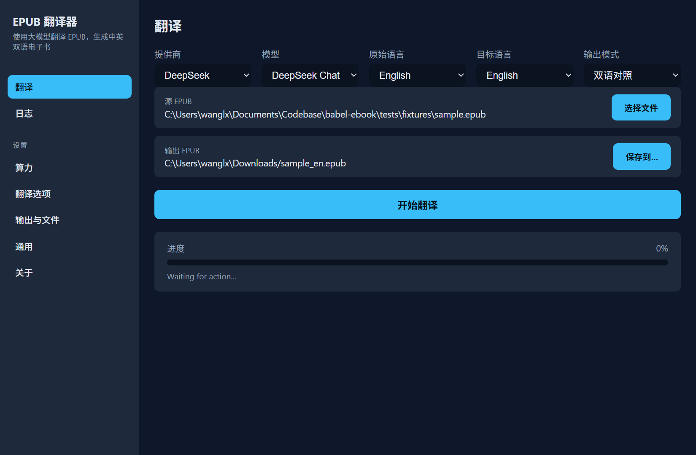

# BabelEbook

[![CI][ci-badge]][ci-url] [![License: MIT][license-badge]][license-url] [![Rust Version][rust-badge]][rust-url]
[![Release][release-badge]][release-url]

**BabelEbook** — это переводчик EPUB, работающий на основе больших языковых моделей. Он создаёт двуязычные электронные
книги (язык оригинала + целевой язык), в которых за каждым переведённым абзацем следует исходный текст.

Читать на других языках: [English](README.en.md)

[ci-badge]: https://github.com/nevertiree/babel-ebook/actions/workflows/ci.yml/badge.svg
[ci-url]: https://github.com/nevertiree/babel-ebook/actions/workflows/ci.yml
[license-badge]: https://img.shields.io/badge/License-MIT-yellow.svg
[license-url]: ../LICENSE
[rust-badge]: https://img.shields.io/badge/rust-1.88%2B-blue.svg
[rust-url]: https://www.rust-lang.org/
[release-badge]: https://img.shields.io/github/v/release/nevertiree/babel-ebook
[release-url]: https://github.com/nevertiree/babel-ebook/releases

> Ваше содержимое EPUB и ключи API обрабатываются только на вашем компьютере и никогда не отправляются на серверы
> разработчиков проекта.
>
> Читать на других языках:
> [中文](README.md) · [English](README.en.md) · [日本語](README.ja.md) · [한국어](README.ko.md) · [Русский](README.ru.md)
> [Español](README.es.md)

<p align="center">
  
</p>

<p align="center">
  <a href="https://github.com/nevertiree/babel-ebook/releases/latest/download/BabelEbook_0.1.0_x64-setup.exe">
    
  </a>
  <a href="https://github.com/nevertiree/babel-ebook/releases/latest/download/BabelEbook_0.1.0_amd64.AppImage">
    
  </a>
</p>

---

## Почему BabelEbook?

| Возможность | BabelEbook | Онлайн-переводчики | Плагины Calibre |
|-------------|------------|--------------------|-----------------|
| Полностью локально: EPUB не загружается | ✅ | ❌ | ✅ |
| Двуязычный параллельный макет | ✅ | Частично | Требуется ручная настройка |
| Установщик для ПК в один клик | ✅ | Не требуется установки | Требуется Calibre |
| DeepSeek / OpenAI / Anthropic / Ollama | ✅ | Фиксированный провайдер | Зависит от плагина |
| Глоссарий, исключающие селекторы, параллелизм | ✅ | Частично | Зависит от плагина |

---

## Скриншоты

| Главное окно | Настройки вычислений | Настройки перевода |
|--------------|----------------------|--------------------|
| ![Главное окно][scr1] | ![Настройки вычислений][scr2] | ![Настройки перевода][scr3] |

| Прогресс перевода | Журналы |
|-------------------|---------|
| ![Прогресс][scr4] | ![Журналы][scr5] |

[scr1]: assets/screenshots/01-translate.png
[scr2]: assets/screenshots/02-settings-compute.png
[scr3]: assets/screenshots/03-settings-translation.png
[scr4]: assets/screenshots/06-translate-progress.png
[scr5]: assets/screenshots/07-logs-progress.png

---

## Поддерживаемые платформы

Десктопный графический интерфейс доступен на:

- **Windows** (рекомендуется): установщики `.exe` (NSIS) и `.msi`.
- **Linux**: портативный `.AppImage` (запуск двойным щелчком) и пакеты `.deb` для дистрибутивов на базе Debian/Ubuntu.

macOS в настоящее время **не имеет** официального установщика для ПК. Пользователи macOS могут собрать и запустить
командную версию из исходников.

---

## Руководство пользователя

### Загрузка и установка

1. Откройте страницу [Releases](https://github.com/nevertiree/babel-ebook/releases).
2. Скачайте установщик для своей системы:

   **Windows**
   - **Рекомендуется для большинства пользователей**:
     `BabelEbook_<version>_x64-setup.exe`
     (установщик NSIS, автоматически соответствует языку системы).
   - **Для ИТ-администраторов или тихого развёртывания**:
     `BabelEbook_<version>_x64_en-US.msi` (установщик MSI).

   **Linux**
   - **Рекомендуется для большинства дистрибутивов**:
     `BabelEbook_<version>_amd64.AppImage`
     (не требует установки; выполните `chmod +x`, затем запустите двойным
     щелчком).
   - **Debian / Ubuntu**: `BabelEbook_<version>_amd64.deb`
     (установите двойным щелчком или выполните
     `sudo dpkg -i BabelEbook_<version>_amd64.deb`).

3. Запустите установщик двойным щелчком и следуйте инструкциям.

> **Отображение китайских шрифтов в Linux:** если в вашей системе Linux не
> установлен китайский шрифт, китайские иероглифы в интерфейсе могут
> отображаться квадратиками. Установите рекомендуемый системой пакет китайских
> шрифтов, например `fonts-noto-cjk` в Debian/Ubuntu:
>
> ```bash
> sudo apt-get install fonts-noto-cjk
> ```

### Первое использование

#### 1. Подготовьте API-ключ

BabelEbook вызывает API большой языковой модели стороннего провайдера. В настоящее время поддерживаются DeepSeek,
OpenAI, Anthropic и локально развёрнутый Ollama.

В качестве примера используем DeepSeek:

1. Посетите [платформу DeepSeek](https://platform.deepseek.com/), зарегистрируйтесь и создайте API-ключ.
2. Откройте BabelEbook и перейдите в **Settings** → **Compute**.
3. Выберите провайдера `DeepSeek` и введите свой API-ключ.
4. Нажмите **Test Connection**, чтобы проверить подключение.

> Если вы используете локальный Ollama, API-ключ не нужен; просто укажите Base URL (например, `http://localhost:11434`).

### Перевод книги

1. На главном экране нажмите **Select EPUB**, чтобы выбрать электронную книгу для перевода.
2. Выберите целевой язык (по умолчанию `zh-CN` — упрощённый китайский).
3. Нажмите **Start Translation**.
4. Выходной файл будет сохранён в указанном вами месте.

### Общие настройки

| Настройка | Описание |
|-----------|----------|
| Provider / API | Выберите поставщика LLM и введите API-ключ. |
| Target Language | Целевой язык перевода, например `zh-CN`, `en`, `ja` и т. д. |
| Output Mode | `bilingual` (оригинал + перевод), `translation_only` (только перевод), `interleaved` (чередование). |
| Concurrency | Количество глав, переводимых параллельно. Выше — быстрее, но дороже. |
| Max Input/Output Tokens | Максимальное число токенов на запрос. Значения по умолчанию обычно подходят. |
| Exclude Selectors | Элементы, которые следует пропустить, например `.code`, `pre`. |
| Glossary | Таблица терминов для закрепления перевода имён собственных. |

### Режимы вывода

- **Bilingual**: за каждым переведённым абзацем следует исходный текст. Хорошо подходит для изучения языка.
- **Translation only**: сохраняется только переведённое содержимое.
- **Interleaved**: абзацы исходного текста и перевода чередуются.

### Язык интерфейса

Десктопное приложение поддерживает следующие языки интерфейса: English (английский), Español (испанский), 日本語
(японский), 한국어 (корейский), Русский (русский) и 简体中文 (упрощённый китайский). Язык интерфейса автоматически выбирается
при первом запуске на основе языка системы и может быть изменён в настройках.

### Часто задаваемые вопросы

**В: Почему результат перевода пустой или отсутствуют главы?** О: Проверьте, не является ли содержимое EPUB
сканированным изображением; если да, сначала выполните OCR. Также можно настроить `Exclude Selectors`, чтобы пропустить
элементы, которые не нужно переводить.

**В: Сколько токенов потребует перевод?** О: Используйте режим **Dry Run** на главном экране или в CLI, чтобы подсчитать
токены без реального вызова API.

**В: Мой API-ключ в безопасности?** О: Да. API-ключи по умолчанию хранятся в Диспетчере учётных данных Windows и не
сохраняются в конфигурационных файлах в виде открытого текста.

---

## Руководство разработчика

### Описание проекта

BabelEbook использует архитектуру Rust + TypeScript:

- **Rust core** (`crates/babel-ebook`): разбор EPUB, разбиение на фрагменты, кеширование, вызовы LLM.
- **Rust CLI** (`crates/babel-ebook-cli`): точка входа для командной строки.
- **Tauri desktop app** (`desktop/`): бэкенд на Rust + фронтенд на React/TypeScript.

### Требования

- [Rust](https://rustup.rs/) 1.88 или новее
- [pnpm](https://pnpm.io/) 9+ (для разработки десктопного приложения)
- Windows 10/11 (для разработки графического интерфейса ПК)
- API-ключ выбранного провайдера

### Быстрый старт

```bash
# Клонировать репозиторий
git clone https://github.com/nevertiree/babel-ebook.git
cd babel-ebook

# Собрать и протестировать рабочее пространство Rust
cargo build --workspace
cargo test --workspace

# Установить зависимости фронтенда десктопного приложения
cd desktop
pnpm install

# Запустить сервер разработки десктопного приложения
pnpm tauri dev
```

### Структура проекта

```text
├── Cargo.toml              # версия рабочего пространства (единый источник истины)
├── crates/
│   ├── babel-ebook/        # основная библиотека перевода (Rust)
│   └── babel-ebook-cli/    # интерфейс командной строки (Rust)
├── desktop/
│   ├── src/                # фронтенд React + i18next (TypeScript)
│   ├── src-tauri/          # бэкенд Tauri на Rust
│   ├── e2e/                # GUI-тесты Playwright
│   └── scripts/            # вспомогательные скрипты сборки и релиза
└── release/v<x.y.z>/       # финальные установщики (генерируются)
```

### Команды сборки

#### CLI

```bash
cargo build --release -p babel-ebook-cli
# Выходной файл: target/release/babel-ebook
```

#### Установщик для Windows

```bash
cd desktop
pnpm install
pnpm tauri build
```

Результат:

- MSI: `target/release/bundle/msi/BabelEbook_<version>_x64_en-US.msi`
- NSIS: `target/release/bundle/nsis/BabelEbook_<version>_x64-setup.exe`

#### Установщик для Linux

В Debian/Ubuntu или совместимых дистрибутивах сначала установите зависимости Tauri:

```bash
sudo apt-get update
sudo apt-get install -y libwebkit2gtk-4.1-dev build-essential curl wget file \
  libxdo-dev libssl-dev libayatana-appindicator3-dev librsvg2-dev xdg-utils
```

Затем соберите приложение:

```bash
cd desktop
pnpm install
pnpm tauri build
```

Результат:

- AppImage: `target/release/bundle/appimage/BabelEbook_<version>_amd64.AppImage`
- deb: `target/release/bundle/deb/BabelEbook_<version>_amd64.deb`

> **Китайский шрифт интерфейса в Linux:** если в вашей системе Linux не
> установлен китайский шрифт, китайские иероглифы в интерфейсе могут
> отображаться квадратиками. Установите `fonts-noto-cjk` или другой системный
> китайский шрифт:
>
> ```bash
> sudo apt-get install fonts-noto-cjk
> ```

### Проверки качества

Перед созданием PR убедитесь, что следующие команды завершаются успешно:

```bash
cargo fmt -- --check
cargo clippy --workspace --all-targets -- -D warnings
cargo test --workspace

cd desktop
pnpm exec tsc --noEmit
pnpm build
```

### Рекомендации по участию

Приветствуется любой вклад! Пожалуйста, сначала прочитайте [.github/CONTRIBUTING.md](.github/CONTRIBUTING.md),
[.github/CODE_OF_CONDUCT.md](.github/CODE_OF_CONDUCT.md) и [.github/SECURITY.md](.github/SECURITY.md).

#### Модель ветвления

Этот проект следует **Git Flow**:

- `master`: опубликованный production-код.
- `develop`: ежедневная интеграционная база.
- `release/<version>`: ветка стабилизации релиза.
- `feature/<name>`: функциональная ветка.

#### Стиль коммитов

- Используйте [Conventional Commits](https://www.conventionalcommits.org/):
- `feat:` новая функция
- `fix:` исправление ошибки
- `docs:` обновление документации
- `refactor:` рефакторинг
- `chore:` сборка/инструменты/прочее
- Делайте коммиты небольшими и сфокусированными.
- Не коммитьте API-ключи, личные пути или внутренние планировочные документы.

#### Требования к PR

1. Все проверки CI проходят успешно.
2. Обновите `docs/README.md` и `CHANGELOG.md`, если изменения затрагивают пользовательское поведение.
3. Ограничьте diff рамками функции или исправления.
4. Изменения десктопного приложения должны включать или обновлять E2E-тесты Playwright.

### Процесс релиза

```bash
cd desktop

# 1. Поднять версию (patch / minor / major), синхронизировать
#    Cargo.toml/package.json/tauri.conf.json и создать тег
pnpm version:bump minor

# 2. Выполнить полную сборку на коммите с тегом
pnpm release:build
```

Финальные артефакты копируются в `release/v<version>/`.

### Расширенное использование CLI

```bash
export DEEPSEEK_API_KEY=sk-...

cargo run --release -p babel-ebook-cli -- input.epub -o output.epub \
  --provider deepseek \
  --model deepseek-chat \
  --concurrency 3 \
  --max-input-tokens 4000 \
  --max-output-tokens 2000

# Только оценить число токенов, не вызывая API
cargo run --release -p babel-ebook-cli -- input.epub -o output.epub --dry-run

# Использовать JSON-файл конфигурации
cargo run --release -p babel-ebook-cli -- input.epub -o output.epub --config config.json
```

Полный список аргументов CLI выведет команда `babel-ebook --help`.

### Поддерживаемые провайдеры LLM

| Провайдер | `--provider` | Модель по умолчанию | Base URL | Примечания |
|-----------|--------------|---------------------|----------|------------|
| DeepSeek | `deepseek` | `deepseek-chat` | `https://api.deepseek.com` | Рекомендуемый по умолчанию |
| OpenAI | `openai` | — | `https://api.openai.com/v1` | Требуется явно указать `--model` |
| Anthropic | `anthropic` | `claude-3-5-sonnet-20241022` | `https://www.anthropic.com` | — |
| Ollama | `ollama` | `llama3` | local | API-ключ не требуется |
| OpenAI-compatible | `openai-compatible` | — | Задаётся через `base_url` | Для собственных или прокси-эндпоинтов |

### Безопасность

- **Никогда не коммитьте API-ключи:**
  - Используйте переменные окружения, системное хранилище ключей или локальные
    конфигурационные файлы, указанные в `.gitignore`.
  - Не записывайте API-ключи в код и не коммитьте их в Git.
- Сообщайте об уязвимостях безопасности конфиденциально через
  [.github/SECURITY.md](.github/SECURITY.md).

### Благодарности

Создано с помощью Rust, Tauri, React и i18next.

## Лицензия

MIT
